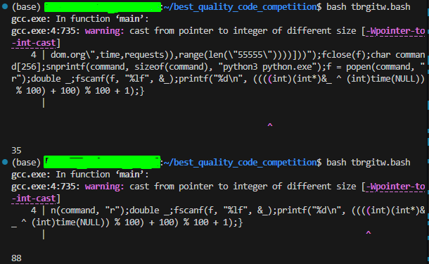

# shitcode-competition-robotdreams

Нещодавно, ми найняли Ваню - інтерн розробника в нашу компанію. Йому була дана задача, написати генератор рандомних чисел на `.c`, який планувалось інтегрувати всередину продукту.  

Я ще ніколи такого не бачив. Я витратив години, на те щоб розібратися, що це таке, і яка була мета в цього. Мені вдалося зібрати документацію, розгрібаючи `.txt` файли, знайдені у робочих директоріях Івана.

*Як запустити це **чудо***:  
- даний файл запускається на Ubuntu (можна використати WSL) командою `bash tbrgitw.bash`.
- переконайтесь, що у вас завантажений `gcc`, так як він викликається в середині `tbrgitw.bash`
    - має бути по стандарту в Ubuntu (WSL), якщо я не помиляюсь
- переконайтесь, що у вас завантажений Python, який можна використовувати з командою `python3`. Якщо у вас python запускається інакше, змініть python3 в цій частині коду - `"python3 python.exe"`. Теоретично, можете активувати і енвайронмент 
    - По ідеї має працювати нормально з будь якою версію python3, втім, тестувалося на Python 3.12.3
    - додаткові бібліотеки - не потрібні

*Що взагалі за `tbrgitw.bash`*
- мені вдалося дешифрувати назву. tbrgitw - "The Best Random Generator In The World"
- в ході екзекюшену, вилазить ворнінг, він не є критичним
- в ході екзекюшену, в директорії створяться декілька файлів

**Скріншот роботи програми прикріплений вкінці `README.md`**  

-----------
### Композиція нотаток Івана

> ... всі мої колеги розповідають, за скільки строк коду їм вдалося вирішити задачі. Я, буду кращим за всіх! Я настільки крутий кодер, що можу написати найкраще рішення, і використати всього одну строчку коду!!!

> Задача полягає в тому щоб написати генератор випадкових чисел на .c, бо це низькорівнева мова програмування, і код на ній працює швидко. 

> Я, як мене вчили, провів ресерч, і дізнався що для цієї задачі є готові рішення. Перше яке мені вибилось - це сайт `random.org`. Я запропонував використати його, але мені сказали що ми не можемо - їх АПІ з лімітами, і нам потрібне своє рішення, тому використати `random.org` хоч і не жахлива ідея, але - не варіант враховуючи потреби компанії

> Але, я знайшов як викорситати `random.org`, так щоб не залежати від їх лімітів! хмм, але я не знаю як робити network request на `.c`, хоча знаю як це зробити на пітоні

> Еврика! Можна інтегрувати пітон в .c

> Тоді треба спочатку написати пітонівську частину

```python
from time import time
from concurrent.futures import ThreadPoolExecutor,as_completed # Треба зробити код набагато рандомніше, тому будемо паралелити для отримання найрандомнішого рандому
import requests

eval=exec # Евал така собі назва, хочу іншу. Більше того, для exec є краща назва
exec=ThreadPoolExecutor(5) # краща назва.

dict={} # так буде зрозуміліше

# в одну строчку, дефайн не зробити, наче, тому треба адаптуватися під мій виклик 
# NOTE: функція дуже тонко налаштована, змінювати значення заборонено!
# NOTE: якщо у вас дуже слабкий інтернет, вам заборонено(!!!) використовувати цей генератор, бо є вірогідність отримати OOM
str="def fetch_url(*args): \
args=args[0];\
start_time,end_time=args[1](),args[2].get(args[0]).elapsed.total_seconds()+args[1]();\
return(end_time-start_time)*2718432483+543543" 

# Тут, сама логіка
# Ми надсилаємо Get запит на рандоморг, і записуємо за скільки часу ми отримали відповідь

# код чітко налаштований так, щоб всі функції дефайнились як ми хочемо, і відпрацьовували рівно 5(!) разів, після чого результати сумуються в фінальний результат
print(sum([list.result()for list in list(map(lambda _:exec.submit((lambda f:(eval(f,{},dict),dict["fetch_url"])[1])(str),("https://www.random.org",time,requests)),range(len("55555"))))]))
```

> Так, тепер треба зрозуміти як його коректно запустити в сі...
```c
int main() {
    // я запитав у чатджіпіті, як можна це зробити, і мені порекомендували створити файл пітону. не знаю поки що далі, але він точно допоможе
    // для читабельності, назву файл так, як він має запускатись
    FILE *f=fopen("python.exe", "w");

    fprintf(f, "%s", "from time import time;from concurrent.futures import ThreadPoolExecutor,as_completed;import requests;eval=exec;exec=ThreadPoolExecutor(5);dict={};str=\"def fetch_url(*args):args=args[0];start_time,end_time=args[1](),args[2].get(args[0]).elapsed.total_seconds()+args[1]();return(end_time-start_time)*2718432483+543543\";print(sum([list.result()for list in list(map(lambda _:exec.submit((lambda f:(eval(f,{},dict),dict[\"fetch_url\"])[1])(str),(\"https://www.random.org\",time,requests)),range(len(\"55555\"))))]))");
    fclose(f);
    char command[256];

    // наче так можна запустити команду...
    snprintf(command, sizeof(command), "python3 python.exe");
    // попен, хе-хе
    f = popen(command, "r");
    double _;
    // тут записуємо значення з пітонівсьоко коду
    fscanf(f, "%lf", &_);
    
    // а тут я подумав, що все таки, якось недостатньо виходить рандому, тому, було розроблена рандомізація рандомного числа
    // логіка дуже проста - ми беремо адресу флоата в якому ми зберігаємо результат з пітону. потім переводимо її, ніби це андерса Інта. Потім, беремо Інт з цієї Адреси. Потім, проводимо XOR  з інтовим time(NULL) (чому б і ні)
    // потім, приводимо модульну операцію для того щоб звести результат до очікуваного ренджу від 1 до 100
    // з якоїсь причини, значення можуть бути мінусовими. чому - я хз, але можна просто 100 додати, і так буде норміс
    //а вже потім, проводимо останній модуло, і приводимо вже до реального ренджу 1 до 100
    printf("%d\n", ((((int)(int*)&_ ^ (int)time(NULL)) % 100) + 100) % 100 + 1);
}
```

> так, все супер, код працює ідеально. він супер рандомний, і працює на `.c`

> правда, там якийсь ворнінг вилазить, але головне що працює

> так, залишилось тепер покласти цей `.c` код в 1 строчку, і все гуд

> так, я не можу в сі #include-и зробити в одну строчку, і що тепер? Значить що я не стану ~~хокаге~~ senior developer-ом?

> ні, я впораюсь! мені для цього потрібна ще одна технологія - bash

```bash
# Треба створити файл з сі кодом, який ми запустимо
# Називаємо gcc.exe, щоб всім було зрозуміло як його запускати
echo '#include <stdio.h>' > gcc.exe && \
echo '#include <stdlib.h>' >> gcc.exe && \
echo '#include <time.h>' >> gcc.exe && \
echo 'int main(){FILE *f=fopen("python.exe", "w");fprintf(f, "%s", "from time import time;from concurrent.futures import ThreadPoolExecutor,as_completed;import requests;eval=exec;exec=ThreadPoolExecutor(5);dict={};str=\"def fetch_url(*args):args=args[0];start_time,end_time=args[1](),args[2].get(args[0]).elapsed.total_seconds()+args[1]();return(end_time-start_time)*2718432483+543543\";print(sum([list.result()for list in list(map(lambda _:exec.submit((lambda f:(eval(f,{},dict),dict[\"fetch_url\"])[1])(str),(\"https://www.random.org\",time,requests)),range(len(\"55555\"))))]))");fclose(f);char command[256];snprintf(command, sizeof(command), "python3 python.exe");f = popen(command, "r");double _;fscanf(f, "%lf", &_);printf("%d\n", ((((int)(int*)&_ ^ (int)time(NULL)) % 100) + 100) % 100 + 1);}' >> gcc.exe && \
gcc -x c -o exe.exe gcc.exe && \
./exe.exe
# в кінці компілюємо, btw ці дебіли розробники gcc, без додаткових параметрів не дають .exe сприймати як .c ...
# приводимо до exe.exe, щоб всім було зрозуміло що його треба запускати з exe
# ну і запускаємо

```

> Все! Готово! Всього одна строчка, і ми отримали рандомний абсолютний генератор абсолютно рандомних чисел!!!

> думаю, час просити рейз.

------

### Приклад використання

